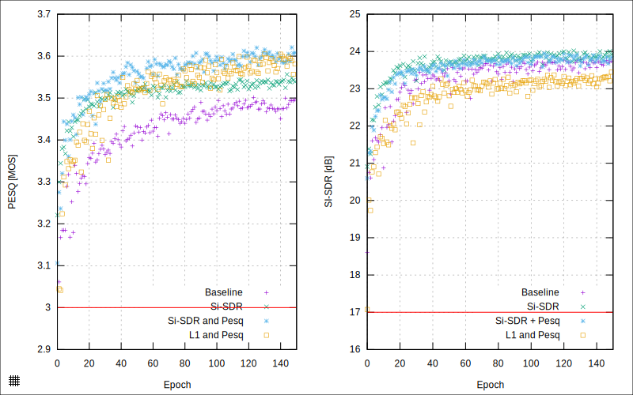

# Loss function inspired by the PESQ score

Implementation of the widely used Perceptual Evaluation of Speech Quality (PESQ) score as a torch loss function. As Delay adjustment and IIR filtering are not implemented, calculated scores may differ from the reference implementation. The PESQ loss alone performs not good for noise suppression, instead combine with scale invariant [SDR](https://arxiv.org/abs/1811.02508). For more information see [1],[2]

## Usage

```python
import torch
from torch_pesq import PesqLoss

loss_fnc = PesqLoss(
    sample_rate=44100, 
    win_length=1024, hop_length=512,
    nbarks=49
)
```
## Small comparison of validation score

Validation results for a [SRU](https://github.com/asappresearch/sru) based noise estimator with ~21ms window length, 50% overlap, 64 Mel features and fullband audio as input:



## Publications

[1]: https://arxiv.org/abs/1901.09146
[2]: https://ieeexplore.ieee.org/document/8468124
[3]: https://www.itu.int/rec/T-REC-P.862
[4]: https://ieeexplore.ieee.org/document/941023
